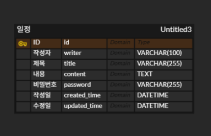

1.일정 등록
- POST /api/schedules
- request: 요청 body
  - {
    "writer": "홍길동",
    "title": "주간 보고서 작성",
    "content": "팀 프로젝트 주간 진행 상황 및 다음 주 계획 정리",
    "password": "secure_password_123"
    }
- response: 등록 정보
  - {
    "id": 1,
    "writer": "홍길동",
    "title": "주간 보고서 작성",
    "content": "팀 프로젝트 주간 진행 상황 및 다음 주 계획 정리",
    "createdTime": "2025-05-25T10:00:00.123456",
    "updatedTime": "2025-05-25T10:00:00.123456"
    }
- 상태코드
  - 200: 등록 성공

2.선택 일정 조회
- GET /api/schedules/{id}
- request: 요청 param
  - /api/schedules/1
- response:  응답 정보
  - {
    "id": 1,
    "writer": "홍길동",
    "title": "주간 보고서 작성",
    "content": "팀 프로젝트 주간 진행 상황 및 다음 주 계획 정리",
    "createdTime": "2025-05-25T10:00:00.123456",
    "updatedTime": "2025-05-25T10:00:00.123456"
    }
- 상태코드
  - 200: 조회 성공

3.전체 일정 조회
- GET /api/schedules
- request: 요청 param
  - /api/schedules
- response: 다건 응답 정보
  - [
    {
    "id": 2,
    "writer": "김철수",
    "title": "헬스장 가기",
    "content": "가슴 운동 3세트",
    "createdTime": "2025-05-25T09:30:00.123456",
    "updatedTime": "2025-05-25T11:15:00.789012"
    },
    {
    "id": 1,
    "writer": "홍길동",
    "title": "주간 보고서 작성",
    "content": "팀 프로젝트 주간 진행 상황 및 다음 주 계획 정리",
    "createdTime": "2025-05-25T10:00:00.123456",
    "updatedTime": "2025-05-25T10:00:00.123456"
    }
    ]
- 상태코드
  - 200: 조회 성공

4.일정 수정
- PUT /api/schedules/{id}
- request: 요청 body
  - {
    "writer": "홍길동",
    "title": "주간 보고서 최종 검토",
    "content": "오탈자 확인 및 최종 제출 준비",
    "password": "secure_password_123"
    }
- response: 수정 정보
  - {
    "id": 1,
    "writer": "홍길동",
    "title": "주간 보고서 최종 검토",
    "content": "오탈자 확인 및 최종 제출 준비",
    "createdTime": "2025-05-25T10:00:00.123456",
    "updatedTime": "2025-05-25T12:30:45.987654"
    }
- 상태코드
  - 200: 수정 성공

5.일정 삭제
- DELETE /api/schedules/{id}
- request: 요청 param
  - {
    "password": "secure_password_123"
    }
- response: (없음)
- 상태코드
  - 200: 삭제 성공

[일정 관리 ERD v1]
